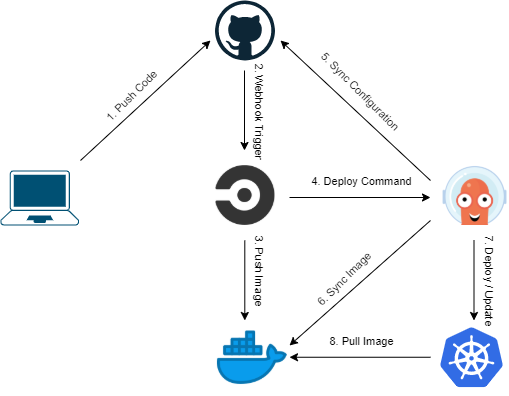

# Local DevOps

This program is written to automate the deployment of any kubernetes, kustomize or helm structured application on a local device with either a Windows or Unix based OS. The deployment will be managed by ArgoCD, synchronized with a GitHub repository and the container is pulled from a DockerHub repository. Before you can begin, make sure the GitHub repository is initialised with a folder containing all the kubernetes .yaml files.   


### Requirements

- [terraform](https://terraform.io) v0.12+
- [kubectl](https://kubernetes.io/docs/tasks/tools/install-kubectl/) `kubectl` command
- [minikube](https://kubernetes.io/docs/tasks/tools/install-minikube/) `minikube` command
- [helm](https://helm.sh/docs/intro/install/) `helm` command
- [argocd](https://argoproj.github.io/argo-cd/cli_installation/) `argocd` command

install with **HomeBrew** (Unix)

``` shell
$ brew install terraform  
$ brew install kubectl  
$ brew install minikube  
$ brew install helm  
$ brew tap argoproj/tap  
$ brew install argoproj/tap/argocd  
```

install with **Chocolatey** (Windows)

``` shell
> choco install terraform  
> choco install kubernetes-cli  
> choco install minikube  
> choco install kubernetes-helm  
```

**Argo CLI** on Windows: download the latest [windows-executable](https://github.com/argoproj/argo-cd/releases) and add it to the path environment variables.

## Enabling Kubernetes

We will use Minikube to host our local Kubernetes server, when Docker Desktop is installed and running, this will automatically run in a Docker container unless specified otherwise. We want to run our Minikube image in a Virtual Machine, therefore it is recommended to completely turn off Docker Desktop before using minikube. 

Start a Kubernetes server using Minikube

``` shell
minikube start --vm=true
minikube addons enable ingress
```

To get the IP address of your cluster

``` shell
minikube ip
```

Once minikube start finishes, run the command below to check the status of the cluster:

``` shell
minikube status
```

If your cluster is running, the output from minikube status should be similar to:

``` text
host: Running
kubelet: Running
apiserver: Running
kubeconfig: Configured
After you have confirmed whether Minikube is working with your chosen hypervisor, you can continue to use Minikube or you can stop your cluster. To stop your cluster, run:
```

``` shell
minikube stop
```

Clean up local state

``` shell
minikube delete
```

## Add a configuration

create a file `configuration.tfvars` in the same directory, and populate it with your configuration. 

``` vim
dockerhub_user = "dockerhub_username"
email = "example@appman.co.th"
git_username = "github_username"
git_server = "appman-agm"
namespaces = "custom_namespace"
git_repository = "github_repo"
yaml_config_directory = "config_dir"
application_name = "appname"
minikube_ip= "result_of_minikube_ip"
```

## How to run

Initial terraform download library

``` shell
cd tf/components/
terraform init -var-file=../env/loc.tfvars
```

Terraform validate and build

``` shell
terraform validate
terraform plan -var-file="./configuration.tfvars"
```

Terraform apply (Will prompt to enter dockerhub and github password)

``` shell
terraform apply -var-file="./configuration.tfvars" -auto-approve  
```
```
clear                       (fully removes the exposed passwords)
```

## Setting Metrics Server for docker-desktop

``` shell
kubectl edit deployment/kubernetes-dashboard-metrics-server -n kubernetes-dashboard
```
Add two arguments and save
``` yaml
- command:
    - ...
    - --kubelet-preferred-address-types=InternalIP,Hostname,ExternalIP
    - --kubelet-insecure-tls=true
```

## Access Kubernetes Dashboard

Now, create a proxy server that will allow you to navigate to the dashboard 
from the browser on your local machine. This will continue running until you stop the process by pressing `CTRL + C`.

```shell
$ kubectl proxy
```

You should be able to access the Kubernetes dashboard [here](http://127.0.0.1:8001/api/v1/namespaces/kubernetes-dashboard/services/https:kubernetes-dashboard:https/proxy/).

```plaintext
http://127.0.0.1:8001/api/v1/namespaces/kubernetes-dashboard/services/https:kubernetes-dashboard:https/proxy/
```

## Authenticate the dashboard

To use the Kubernetes dashboard, you need to provide an authorization token. 
Authenticating using `kubeconfig` is **not** an option. You can read more about
it in the [Kubernetes documentation](https://kubernetes.io/docs/tasks/access-application-cluster/web-ui-dashboard/#accessing-the-dashboard-ui).

Generate the token in another terminal (do not close the `kubectl proxy` process).

```shell
$ kubectl -n kube-system describe secret $(kubectl -n kube-system get secret | grep service-controller-token | awk '{print $1}')

Name:         service-controller-token-46qlm
Namespace:    kube-system
Labels:       <none>
Annotations:  kubernetes.io/service-account.name: service-controller
              kubernetes.io/service-account.uid: dd1948f3-6234-11ea-bb3f-0a063115cf22

Type:  kubernetes.io/service-account-token

Data
====
ca.crt:     1025 bytes
namespace:  11 bytes
token:      eyJhbGciOiJSUzI1NiIsImtpZCI6I...
```

Select "Token" on the Dashboard UI then copy and paste the entire token you 
receive into the 
[dashboard authentication screen](http://127.0.0.1:8001/api/v1/namespaces/kubernetes-dashboard/services/https:kubernetes-dashboard:https/proxy/) 
to sign in. You are now signed in to the dashboard for your Kubernetes cluster.

## Log in to ArgoCD UI

Retrieve the generated password from terraform state.

``` shell
$ terraform output -state="./terraform.tfstate" argocd_initial_password
```
Now, create a port forward that will route you to  the dashboard from the browser on your local machine. This will continue running until you stop the process by pressing `CTRL + C`.

```shell
$ kubectl port-forward svc/argocd-server -n argocd 8080:443
```

You should be able to access the Kubernetes dashboard [here](https://127.0.0.1:8080).

```plaintext
https://127.0.0.1:8080
```